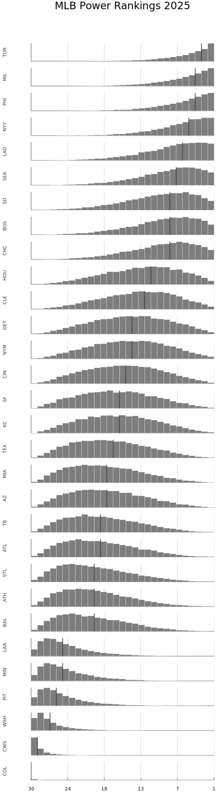

This project is based off of Damon Roberts' [Python implementation](https://github.com/DamonCharlesRoberts/mlb_pred) of the Bradley-Terry model and the Julia port using Turing.jl discussed in [this blog post](https://blog.damoncroberts.io/posts/julia_nuts/). This code is released under the same license as the original `DamonCharlesRoberts/mlb_pred` repo.

I wanted a complete Julia pipeline that captures:
- accessing the MLB stats API
- creating the duck db
- learning the Terry-Bradley model
- post-processing ranks
- visualizing distributions.

A mix of vibe-coding and vanilla coding was used in getting things set up. This repo should not be considered a perfect reproduction of the original environment, e.g., ensuring the same game data is downloaded, same visualization styles, etc.

